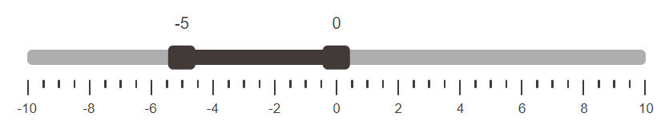

# Range Slider

Range Slider - [jQuery](https://jquery.com/) plugin for setting the range of numeric values via web interface with keyboard and touch control support.

<a href="https://rmstcv.github.io/slider/"></a>

---

Application features:

- Single or range type
- Vertical or horizontal view
- Signatures above the sliders
- Scale of values
- Set slider values
- Keyboard control
- Support for touch devices

---

### [Demo page](https://rmstcv.github.io/slider/)

---

Installation:

[download](https://github.com/rmstcv/slider/blob/gh-pages/slider.js) slider.js <br>
[download](https://github.com/rmstcv/slider/blob/gh-pages/slider.css) slider.css <br>

```js
// jQuery
<script src="https://code.jquery.com/jquery-3.6.0.min.js"></script>
// slider files
<link href="slider.css" rel="stylesheet">
<script src="slider.js"></script>
```

---

Slider initialization:

```js
$('.selector').sliderPlugin(options);
```

Changing values:

```js
slider.setSlider(parameter, value);
```

Get values:

```js
slider.getState();
```

Custom event:

```js
slider.onChange(() => {
  someFunction();
});
```

Options by default:

```js
 {
    min: -10,
    max: 0,
    step: 0.0005,
    valueFrom: -5,
    valueTo: 0,
    type: 'range',
    orientation: 'horizontal',
    scale: true,
    toolTip: true,
  }
```

All parameters:
|param|value type|
| --- | --- |
|'min'|number|
|'max'|number|
|'step'|number|
|'valueFrom'|number|
|'valueTo'|number|
|'type'|'range' / 'single'|
|'orientation'|'vertical' / 'horizontal'|
|'scale'|boolean|
|'toolTip'|boolean|

Examples:

```js
const slider = $('.selector').sliderPlugin({
  max: 100,
  valueTo: 5,
  type: 'range',
  scale: true,
});

slider.setSlider('min', -10);
slider.setSlider('orientation', 'vertical');
slider.setSlider('toolTip', false);
slider.getState().max;
```

---

[docs](https://github.com/rmstcv/slider/blob/main/doc/doc.md)
